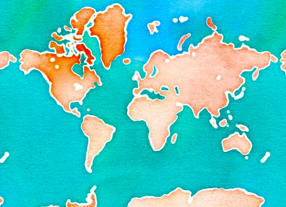
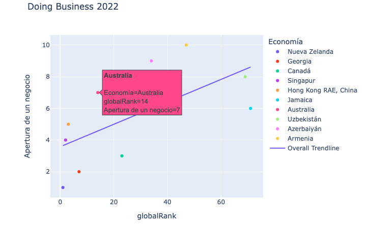
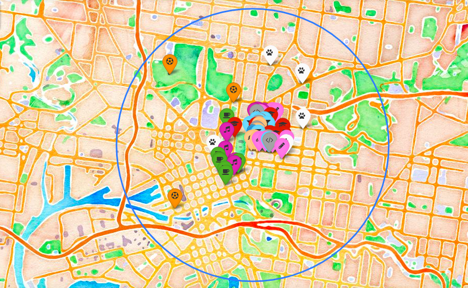
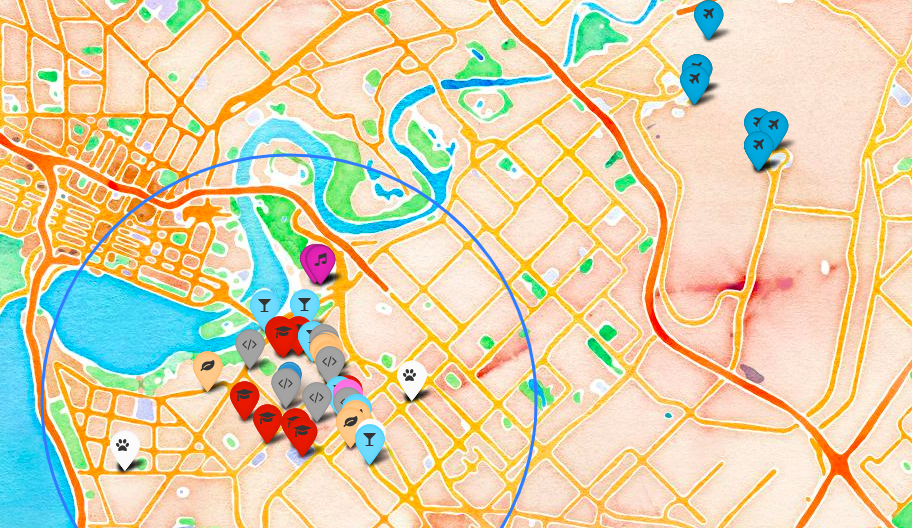
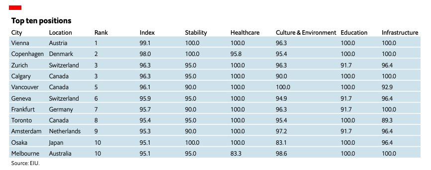

  <h3 align="center"> 🏴‍☠️ Treasure hunting the best place in the world to start a videogame company 🏴‍☠️</h3>

  <h6 align="center">
    Ironhack: project III

## Table of contents

- [Introduction](#introduction)
- [Mongo DB](#mongo-db)
- [Doing Business](#doing-business)  
- [Foursquare API](#foursquare-api)
- [Wheighting employees requirements](#wheighting-employees-requirements)
- [Best place to build a videogame business](#best-place-to-build-a-videogame-business)
- [References](#references)

### Introduction

In this analysis, I tried to look for the best place in the world to build a new videogame company. I based my decision on 3 things: 
* The number of similar companies in the area (taken from the companies database in MongoDB).
* The World Bank's "Doing Business" index for 2022.
* The Global Liveability Index 2022. 

### Mongo DB 

The data used for this analysis was obtained from the Mongo DB "companies" database, which contains a big number of companies from different fields. For this specific purpose I filtered the data to obtain only the companies that are in the tech and design categories. Later, I got a dataframe with 256 companies and filtered the 5 countries with more companies.

Those countries are: 
1. USA    
2. UK   
3. Germany    
4. Canada   
5. **Australia**    

One problem I encountered with this data is that it stops in 2013, and a lot can change in 9 years, that's why I decided to look in a more up-to-date database to make a more informed decision. 

### Doing Business

I searched in the World Bank's database for the "Doing Business Index" which measures the facility of opening and running a new business in 190 countries in the world. A high ease of doing business ranking means the regulatory environment is more conducive to the starting and operation of a local firm. The rankings are determined by sorting the aggregate scores on 10 topics, each consisting of several indicators, giving equal weight to each topic.

After analyzing the data we can filter the top 10 countries in which is easier to start a business from scratch and make a scatterplot to see from those ten countries which has an overall highscore in maintaining that business (not just starting it). From the scatterplot below we can see that Australia is on the top 10, and it was on top 5 countries with tech/design companies in Mongo, so this is the country I chose to start the business. 

### Foursquare API

After choosing Australia, I got the coordinates for one office in Melbourne and one in Perth from the Mongo database to see which location satisfies the employees requirements best. 

This are the requirements I looked for in the API and the maximum distance from the office: 

* Other **design companies**, so that designers can go to talks and do networking (2km)
* **Schools**, so that 30% of the employees can leave their kids on their way to work (3 km) 
* **Starbucks**, so that executives are happy (2km)
* **Bars & Clubs**, so that employees can go for drinks after work (2km) 
* **Basketball Courts** that are close, so the maintainance guy can practice (4km) 
* **Vegan restaurants**, so the CEO can eat (1.5km) 
* **Pet grooming** for Dobby (3km)
* **Airports** so employees can travel easily (30km) 

#### Melbourne

#### Perth

### Best place to build a videogame business

#### Melbourne vs. Perth 🥊 🦘

### References

- https://rsf.org/en
- https://rsf.org/en/index-methodologie-2022